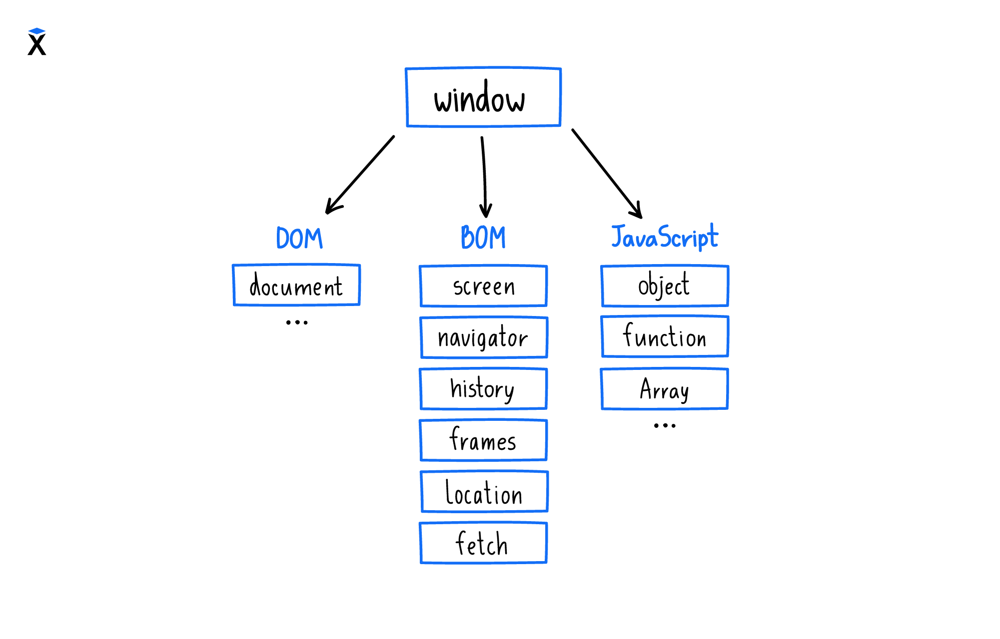
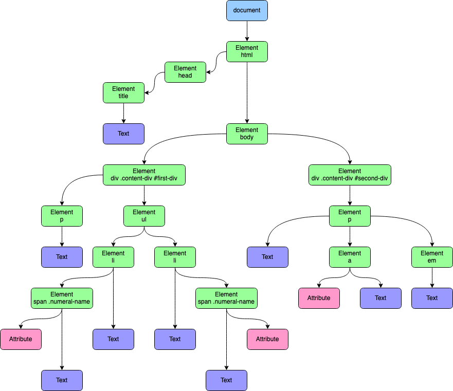
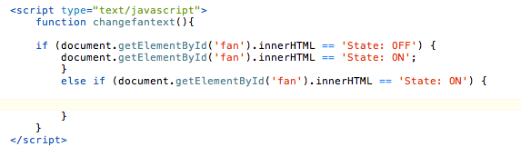

# Java Script
# Lecture 8
# Table of Contents
## 1. Dom
## 2. Bom
## 3. Event
## 4. Dom Methods

# Что такое Bom в Java Script ?

+ Bom - Browser Object Model
+  The Browser Object Model (BOM) allows  
+ JavaScript to "talk to" the browser.
+ The Browser Object Model (BOM) is the
+ additional objects provided by the
+ browser (environment) to work with
+ everything other than the document
+ Например :


# Что такое Dom в Java Script ?

+ Dom - Document Object Model
+  "Document Object Model". It's a 
+ standardized  way of representing the + structure of a document
+ (such as HTML) as a tree-like structure, +    where each node represents a part of the + document, such as an
+ element, attribute, text content, etc. DOM + allows programs and scripts to access, + manipulate, and
+ update the content, structure, and styles of + a web page. JavaScript is commonly used to + interact with
+ the DOM in web development, for tasks such as + dynamically changing the content of a page or +handling
+ user events.

+ Например : 



```js
const paragraphs = document.querySelectorAll("p");
// paragraphs[0] is the first <p> element
// paragraphs[1] is the second <p> element, etc.
alert(paragraphs[0].nodeName);
```
+ Структура Dom как структура дерево с перва  
+ идёт Doctype а потом teg html потом teg head 
+ и body а потом teg-и body

# Что мы можем сделать с помощью JavaScript-а;
### 1.Мы можем дат стиль
### 2.Мы можем создавать teg-и
### 3.Mы можем изменят teg-и html и т.д

# Что такое innerHTML, innerText и TextContent

### C помощью этих element мы изменяем значения teg-и



```js
let name = "John";
// assuming 'el' is an HTML DOM element
el.innerHTML = name; // harmless in this case

// …

name = "<script>alert('I am John in an annoying alert!')</script>";
el.innerHTML = name; // harmless in this case
```

# Методы Dom 
### QuerySelector()
### QuerySelectorAll()
### GetElementById()
### И  Т . Д